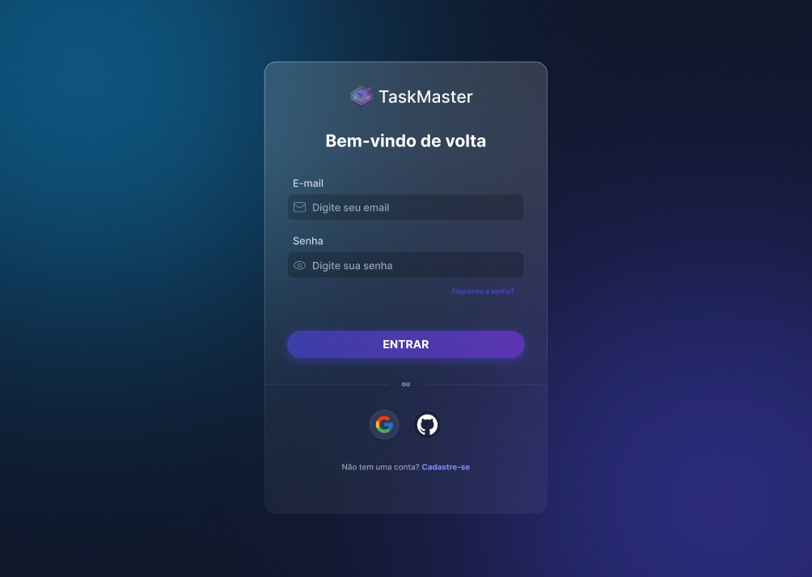
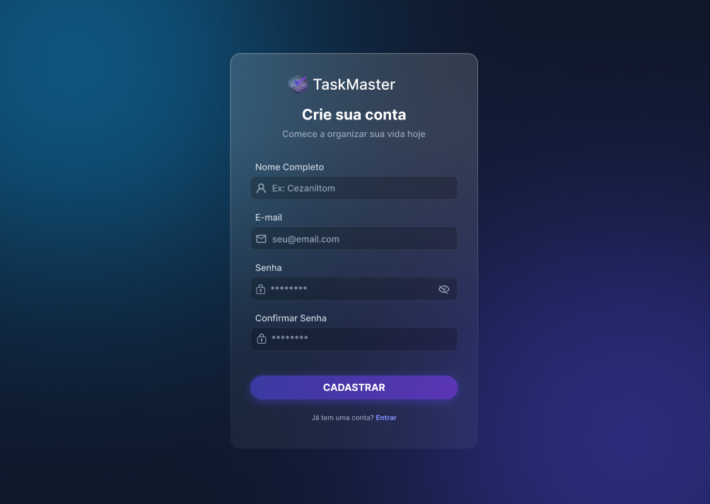
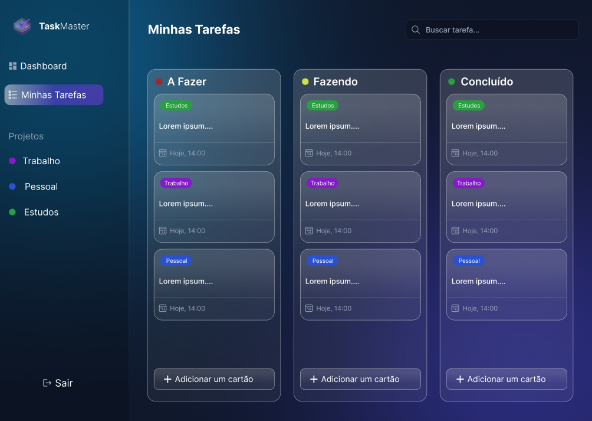

# TaskMaster (TCC Pós-Graduação Full Stack)

## 📋 Sobre o Projeto

O **TaskMaster** é uma aplicação projetada para demonstrar a implementação de uma arquitetura moderna e desacoplada. O objetivo principal deste repositório é validar a arquitetura de **microsserviços containerizados**, a modelagem de dados relacional e a segurança via autenticação.

Embora o foco desta implementação seja a **API (Backend)** e a **Infraestrutura (Docker)**, o projeto conta com prototipagem de alta fidelidade para a interface de usuário.

## 🛠 Tecnologias & Arquitetura

O projeto foi construído sobre uma pilha tecnológica robusta:

- **Runtime:** Node.js (v18+)
- **Framework:** Express (API RESTful)
- **Banco de Dados:** MySQL 8.0 (Containerizado)
- **ORM:** Prisma (Schema & Migrations)
- **Infraestrutura:** Docker & Docker Compose
- **Linguagem:** TypeScript (Tipagem Estática)

## 🗂 Modelagem de Dados (Prisma)

O banco de dados garante integridade referencial com as seguintes entidades principais:
- **User:** Gerenciamento de credenciais e perfil.
- **Account:** Suporte para autenticação OAuth (Google/GitHub).
- **Task:** Tarefas com prioridade, vencimento e status.
- **Category:** Classificação organizacional.

## 🎨 Protótipos de Interface (UI/UX)

O design do sistema foi concebido seguindo os princípios de *Glassmorphism* e *Dark Mode*.

| Tela de Login | Cadastro |
|:---:|:---:|
|  | 

| Dashboard | Tasks |
|:---:|:---:|
|  | 

## 🔧 Como Rodar o Projeto

Siga os passos abaixo para subir a infraestrutura completa localmente:

### 1. Pré-requisitos
- Docker & Docker Compose instalados.
- Node.js (v18 ou superior).

### 2. Instalação

```bash
# Clone o repositório
git clone [https://github.com/Cezaniltom/tcc-project.git](https://github.com/Cezaniltom/tcc-project.git)

# Entre na pasta
cd tcc-project

# Instale as dependências do Node
npm install
```

### 3. Subindo a Infraestrutura (Docker)
Sobe o banco MySQL em segundo plano

````bash
docker-compose up -d
````

### 4. Configurando o Banco de Dados
Gera o cliente do Prisma e cria as tabelas no MySQL

````bash
npx prisma migrate dev --name init
````

### 5. Executando a API

````bash
npm run dev
````

O servidor iniciará em http://localhost:3000

Autor: Cezanilton
